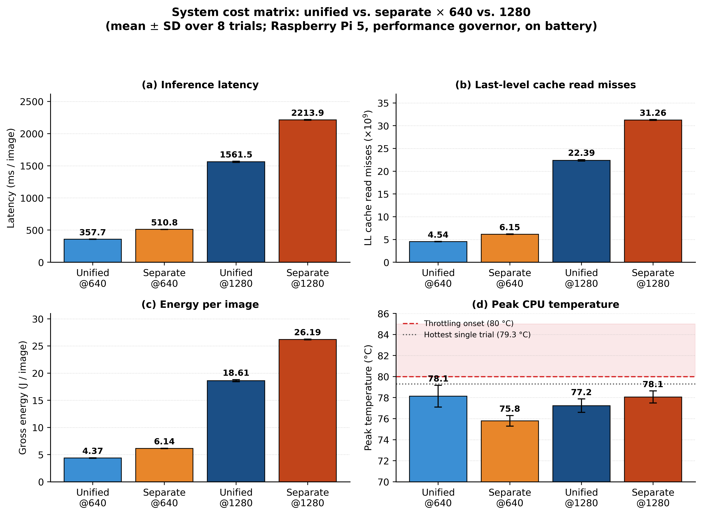
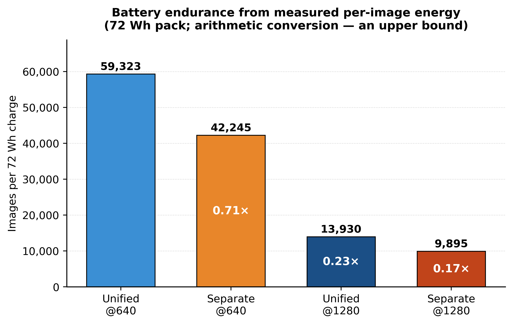
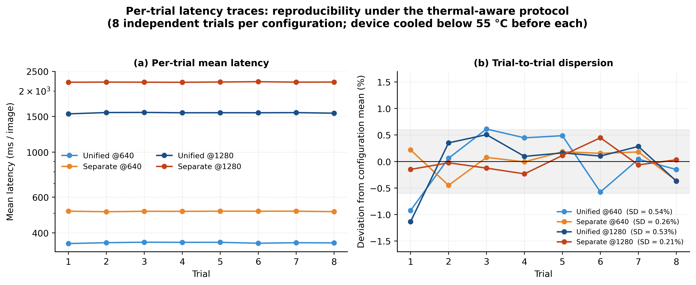
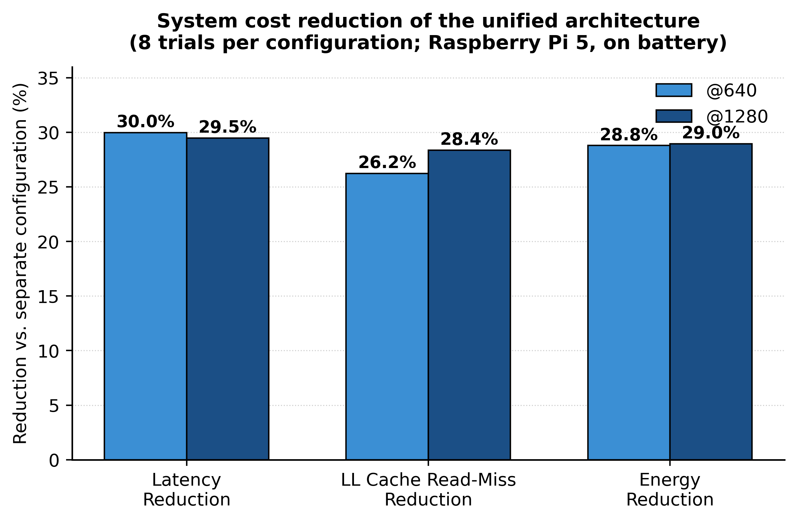

# One Model or Two? — Unified vs. Separate Detection Architectures on the Edge

Reproducibility repository for:

**"One Model or Two? A Systems Comparison of Unified versus Separate Detection Architectures for Edge-Deployed Crop Disease Monitoring"**
Ding Shan Lin, UCSI University · ORCID [0009-0009-6031-8479](https://orcid.org/0009-0009-6031-8479)

---

## The question

You have 12 categories to detect: 5 foliar diseases, 7 pest-related classes. On a Raspberry Pi 5, do you:

- **(A) Unified** — train ONE 12-class detector, or
- **(B) Separate** — train a 5-class leaf detector + a 7-class pest detector and run both?

Everyone assumes **(B)** is more accurate ("specialists are better at their own job"), and nobody checks what **(B)** costs at the system level.

**Three results.**

1. **Accuracy does not favour the separate configuration at either resolution** — not even when it is given the cross-model fusion stage a real deployment would run.

2. **The system axes decide it.** The unified model is **30% faster**, generates **26–28% fewer** last-level cache read misses, and draws **~29% less measured energy** per image (all *p* < 10⁻¹³). And the separate configuration measured here carries the *smaller* pest backbone — so it is the **best case** for the separate architecture. A capacity-matched one would cost **2.00×** the unified detector's latency.

3. **Raising the input resolution from 640 to 1280 costs 4.4× latency and 4.3× energy, and moves mean AP@0.5 by +0.007.** It does not add accuracy. It *redistributes* it: small-target classes gain, large-target classes lose (Spearman ρ = −0.72, p = 0.008).

**What is NOT claimed.** Peak temperature does **not** discriminate the two architectures. The ordering between them reverses between two independent sessions on the same hardware (see `results/session_replication/`). No trial in either session throttled.

---

## Verify every number in the paper, right now

```bash
python scripts/reproduce_paper.py
```

This regenerates **every system-level number in the paper** — Tables III and IV, all Welch tests, the second-model subtraction argument, the capacity-matched bound, the resolution-scaling ratios, and the cross-session replication check — directly from `results/`. Nothing is hard-coded.

```
Configuration     Params  GFLOPs   Latency/img (ms)   LL-miss rd (e9)  Peak T (C)   Thr
Unified @640        9.43    21.6      357.7 +/-  1.9     4.54 +/- 0.04  78.1 +/- 1.0  0/8
Separate @640      12.02    28.0      510.8 +/-  1.3     6.15 +/- 0.05  75.8 +/- 0.5  0/8
Unified @1280       9.43    86.3     1561.5 +/-  8.2    22.39 +/- 0.15  77.2 +/- 0.6  0/8
Separate @1280     12.02   112.0     2213.9 +/-  4.7    31.26 +/- 0.09  78.1 +/- 0.6  0/8
```

Cache counters come from the Cortex-A76's **hardware performance counters**, not from estimates. Energy comes from an **in-line measurement at the battery rail**, not from a power envelope.

---

## Headline numbers

All four configurations scored on **one common 12-class validation set** (187 images, 1,765 instances). See *Problem 6* below for why that sentence needed an audit before it could be written.

### Accuracy

| Configuration | mAP@0.5 @640 | mAP@0.5 @1280 |
|---|---|---|
| **Unified (single model)** | **0.483** | 0.490 |
| Separate, no fusion (B1) | 0.399 | 0.429 |
| Separate + cross-model NMS (B2) | 0.453 | 0.493 |

The nominal 1280 reversal (0.493 vs. 0.490) is produced **entirely** by two classes carrying four and twenty validation instances, declared non-interpretable *a priori*. Excluding them the unified detector leads at both resolutions (0.482 vs. 0.417; 0.515 vs. 0.485), and instance-weighting gives the same picture (0.436 vs. 0.391; 0.520 vs. 0.482).

### Per class, ordered by mean target area

| Class | Inst. | Area (px²) | Uni@640 | Sep@640 B1 | Sep@640 B2 | Uni@1280 | Sep@1280 B1 | Sep@1280 B2 | Δ Uni (640→1280) |
|---|---|---|---|---|---|---|---|---|---|
| Stem_borer | 33 | 336 | 0.151 | 0.088 | 0.099 | 0.132 | 0.144 | 0.173 | −0.019 |
| Psyllid_damage | 418 | 494 | 0.366 | 0.210 | 0.286 | 0.479 | 0.372 | 0.457 | **+0.113** |
| Psyllid | 539 | 1,140 | 0.317 | 0.234 | 0.268 | 0.476 | 0.361 | 0.400 | **+0.159** |
| Algal | 275 | 1,529 | 0.416 | 0.411 | 0.436 | 0.464 | 0.414 | 0.437 | +0.048 |
| weevil_damage | 78 | 2,190 | 0.823 | 0.593 | 0.740 | 0.929 | 0.860 | 0.936 | +0.106 |
| Scale_insect | 57 | 6,538 | 0.242 | 0.074 | 0.125 | 0.296 | 0.200 | 0.245 | +0.054 |
| Phomopsis | 160 | 12,203 | 0.810 | 0.802 | 0.778 | 0.818 | 0.784 | 0.795 | +0.008 |
| weevil † | 4 | 13,209 | 0.578 | 0.745 | 0.745 | 0.495 | 0.662 | 0.697 | −0.083 |
| Leaf_rot | 83 | 36,885 | 0.784 | 0.791 | 0.801 | 0.776 | 0.689 | 0.693 | −0.008 |
| leafhopper_damage | 39 | 48,864 | 0.513 | 0.127 | 0.195 | 0.435 | 0.196 | 0.283 | −0.078 |
| Root_disease | 59 | 70,358 | 0.393 | 0.383 | 0.442 | 0.346 | 0.308 | 0.428 | −0.047 |
| Pink_disease † | 20 | 291,112 | 0.407 | 0.324 | 0.521 | 0.235 | 0.160 | 0.370 | **−0.172** |
| **mean** | **1,765** | — | **0.483** | **0.399** | **0.453** | **0.490** | **0.429** | **0.493** | **+0.007** |

**B1** = leaf + pest merged, no fusion (strict lower bound). **B2** = class-agnostic NMS at IoU 0.5 over the merged prediction set (the fair operating point). Reproduce with `python scripts/refair_eval_commonval.py` — it prints all six per-class blocks.

† Severely under-sampled in validation; declared non-interpretable *before* any comparison was made.

Six classes gain from 1280 (mean area **4,016 px²**); six lose (mean area **76,794 px²**), a **19×** difference. The gains and losses cancel — which is why the mean barely moves.

### System cost — all measured

| Config | Latency/img | LL-cache miss | Gross E/img | Frames/J (rel.) | Images / 72 Wh | Peak T |
|---|---|---|---|---|---|---|
| **Unified @640** | **357.7 ms** | **4.54 ×10⁹** | **4.37 J** | **1.00×** | **≈59,300** | 78.1 °C |
| Separate @640 | 510.8 ms | 6.15 ×10⁹ | 6.14 J | 0.71× | ≈42,200 | 75.8 °C |
| Unified @1280 | 1561.5 ms | 22.39 ×10⁹ | 18.61 J | 0.23× | ≈13,900 | 77.2 °C |
| Separate @1280 | 2213.9 ms | 31.26 ×10⁹ | 26.19 J | 0.17× | ≈9,900 | 78.1 °C |

Energy is the trapezoidal integral of the 2 Hz battery-rail trace divided by 300 images (**gross** — it includes the platform's idle floor). `Images / 72 Wh` is an arithmetic conversion assuming full depth of discharge and continuous inference: **an upper bound**, not a discharge measurement.

**Peak temperature is listed for completeness and is not a result.** It does not separate the architectures — the ordering reverses between sessions.



---

## The second model costs more than its arithmetic

The separate configuration executes **1.30× the FLOPs** but costs **1.42–1.43× the wall time**. Because the leaf model shares the unified model's backbone, input size and FLOP count (differing only in output class count), the second model's incremental cost is recoverable by subtraction:

| | @640 | @1280 |
|---|---|---|
| Second model costs | 153.1 ms for 6.4 GFLOPs | 652.4 ms for 25.8 GFLOPs |
| FLOP-proportional prediction | 106.0 ms | 466.8 ms |
| **Overshoot** | **+44%** | **+40%** |
| Its FLOP throughput | 41.8 GFLOPS (**69%** of unified) | 39.5 GFLOPS (**72%**) |
| Its LL misses per GFLOP | 0.252 ×10⁹ (**+20%**) | 0.344 ×10⁹ (**+32%**) |

**This is entangled with a backbone asymmetry, and the paper says so.** The deployed pest model is YOLO11n; the leaf and unified models are YOLO11s. That confound works *against* the separate configuration on accuracy but *in favour of it* on every system axis. A capacity-matched separate configuration (2 × YOLO11s) would be 18.86 M params and **43.2 GFLOPs = 2.00×** the unified detector's arithmetic, costing ≈715 ms/image — a **2.00× latency ratio** rather than 1.43×.

**So the configuration measured here is the best case for the separate architecture, and it still loses by 30%.**

### Free of that confound: FLOPs do not predict wall time on this platform

The unified model's own resolution scaling — one model, one backbone, one thread count:

| | 640 → 1280 |
|---|---|
| Arithmetic | **4.00×** (exactly) |
| Last-level cache read misses | **4.94×** |
| Wall-clock latency | **4.37×** |
| Gross energy | **4.26×** |

Quadrupling the input area quadruples the arithmetic exactly, but memory traffic grows nearly fivefold and measured latency lands between the two. The model's weights are **36.2 MiB against a 2 MiB shared L3** — a factor of eighteen — so weights can never be resident and are streamed from DRAM on every inference.

**A cost model based on FLOPs systematically under-predicts wall time on this hardware.** That is the sense in which a second model is expensive: it adds not only arithmetic but a second full traversal of a memory hierarchy that is already the binding constraint.

---

## Measuring power, rather than assuming it

Energy is read from the UPS HAT's power-management MCU (I²C `0x2D`) at **2 Hz**, at the **battery pack** (13.6–16.7 V) — **upstream of the HAT's 5 V buck converter**. Reported power therefore includes the SoC, the active cooler, the HAT's quiescent draw, and buck conversion loss. That is the draw that sets field endurance.

| | Published Pi 5 (with active cooler) | **This deployment node** |
|---|---|---|
| Idle | 2.6–3.0 W | **4.7–4.8 W** |
| Active (sustained) | 6.8–8.8 W | **11.8–12.3 W** |

**1.4–1.8× the published board-level figure.** Both published sources already include the Active Cooler, so the excess is *not* the fan: it is the HAT's quiescent draw, the loss across its buck converter, and the change of measurement node.

> **Any energy or endurance budget computed from published board-level figures will be optimistic by a large factor.**

Two independent witnesses confirm battery operation on **every sample of every trial**: negative pack current **and** zero VBUS input power. A control experiment shows discharge does not confound the comparison: under fixed CPU load, active power varied by only **0.35%** between a full pack (16.57 V) and a 25%-charged pack (13.57 V).

**Active power is essentially constant across all four configurations** (11.84–12.26 W, a spread under 4%, with no consistent ordering between architectures). So the energy advantage tracks the latency advantage almost exactly: **the unified detector wins on energy because it finishes sooner, not because it draws less power while running.**



---

## Reproducibility, and what the replication session shows

`results/` holds the **reported session** (27 columns, with full power and provenance telemetry).
`results/session_replication/` holds an **earlier, independently-run session** (11 columns, before the power instrumentation was added).

Both are released, because they support two different claims.

**1. The system figures replicate.** Across all four configurations:
- every **cache** figure reproduced to within **0.47%**
- every **latency** figure reproduced to within **0.82%** (largest: unified @1280, 1574.4 vs. 1561.5 ms)

**2. The thermal ordering does *not* replicate — and that is the point.**

| | Replication session | Reported session |
|---|---|---|
| @640 | separate hotter (77.65 vs. 75.86 °C) | **unified** hotter (78.13 vs. 75.79 °C) |
| @1280 | **unified** hotter (79.30 vs. 78.82 °C) | separate hotter (77.24 vs. 78.06 °C) |

The ordering reverses at **both** resolutions. Both sessions yield nominally significant *p*-values, in opposite directions. This is precisely why **no architectural claim is made from peak temperature** — a single thermal session, however tight its error bars, is not a basis for one.

**Within-session dispersion is tight.** Latency standard deviation is below **0.6%** of the mean for every configuration (0.54%, 0.26%, 0.53%, 0.21%), and no trial drifts systematically across a session — the pre-trial cool-down below 55 °C prevents the thermal accumulation that would otherwise make later trials slower.



**Thermal margin is thin, and that *is* a result.** No trial in either session throttled. But the hottest single trial reached **79.3 °C** against the vendor's **80 °C** throttling onset — **0.7 °C of headroom, indoors**. None of these configurations should be assumed to survive tropical field ambient without throttling.

---

## Where this study came from

This is not a standalone experiment. It is the fourth step in a chain, and the earlier steps made it possible.

| Step | Study | What it established |
|---|---|---|
| **1** | *Dataset integrity audit* | Two coupled faults: a **train/val leakage path** (augmented copies generated *before* the split), and a **label-space collapse** (one disease class absorbed a visually similar neighbour during whole-leaf annotation), suppressing several classes to AP = 0.000. |
| **2** | *Compute–thermal co-design of co-located dual-model inference* | Fixed the annotation protocol (lesion-level), built the two-model system, found sequential scheduling beats parallel. **Attributed** that result to L2/L3 cache contention — but **never measured cache**, and interpolated energy from a published TDP figure. |
| **3** | *Cross-platform validation* | Replicated the scheduling findings on Jetson Orin Nano. |
| **4** | **This study** | Asks the question step 2 never asked: **do you need two models at all?** Measures the cache counters step 2 could only hypothesize, and the energy step 2 could only estimate. |

**This study was announced in advance by step 2.** Step 2 recorded that hardware performance-counter instrumentation of cache behaviour *"is the subject of a separate, dedicated study,"* and that its TDP-interpolated energy figures should be replaced by *"direct instrumentation with an inline shunt."* This repository is that study.

**And it argues against the architecture of the author's own prior work.** Step 2 assumes two models are required and asks only how to schedule them. This study asks whether the second model is needed, and answers *no*.

An earlier attempt (around step 1) to merge all categories into one detector **failed** — for annotation reasons, not architectural ones. A capacity ablation showed a larger backbone did not rescue the suppressed classes, while re-annotation at lesion-level granularity raised the same classes from 0.00 to 0.48–0.81. Only after the annotation was corrected did this comparison become a meaningful experiment.

---

## Repository structure

```
.
├── README.md
├── scripts/
│   ├── merge_datasets.py            # merge source datasets → 12-class, with leakage self-check
│   ├── split_audit.py               # cross-export image-identity audit (see Problem 6)
│   ├── train_all.py                 # train all 6 models under identical hyperparameters
│   ├── export_onnx.py               # .pt → .onnx for on-device benchmarking
│   ├── cache_benchmark.py           # on-device: latency + PMU counters + battery-rail power + provenance
│   ├── refair_eval_commonval.py     # ← THE evaluation script. Scores all four configs on ONE val set.
│   ├── target_size.py               # per-class bbox pixel area → "small" vs "large" targets
│   ├── reproduce_paper.py           # ← regenerates EVERY system number in the paper from results/
│   └── make_figures.py              # regenerates every figure from results/
├── results/
│   ├── cachebench_{combined,separate}_{640,1280}.csv     # reported session, 27 columns
│   └── session_replication/
│       └── cachebench_{combined,separate}_{640,1280}.csv # earlier session, 11 columns, no power
├── figures/
├── docs/
│   └── env_report.txt               # full on-device environment dump (see note below)
└── data/
    └── data.yaml.example
```

### What is in a trial record

Each of the 32 trial records in `results/` carries, alongside latency and the PMU counters:

`p_idle_w`, `p_active_w`, `energy_j`, `energy_per_img_j`, `n_pwr` — the power measurement
`vbat_start_v`, `vbat_mean_v`, `vbat_end_v`, `ibat_mean_a`, `soc_start_pct`, `soc_end_pct` — the battery state
`vbus_mw_max`, `on_battery` — the two independent on-battery witnesses
`governor`, `ort_threads`, `ort_version` — the provenance columns

**So every methodological claim in the paper's Section III-A is verifiable from the artifact**, not merely asserted.

### The environment, dumped from the device

`docs/env_report.txt` is the full on-device environment capture: board revision, cache
topology, kernel and **VideoCore firmware** version, ONNX Runtime configuration, ONNX
artefact metadata, and the I²C scan showing the fuel gauge at `0x2d`.

Two lines in it are easy to misread, and the file says so at the top:

- The **governor** line reads `ondemand` because the dump was taken at idle, *before*
  `lock_governor.sh` was applied. `cache_benchmark.py` **refuses to start** unless every
  core reads `performance`, and all 32 trial records carry `governor=performance`.
- **`intra_op_threads: 0`** is ONNX Runtime's *default* SessionOptions value. The harness
  sets it explicitly (`so.intra_op_num_threads = 4`) and records it; every trial record
  carries `ort_threads=4`.

**And one line settles a question this project got wrong for a while.** The board exposes
**no 82 °C trip point**. Its thermal zones expose only the Active Cooler's fan-curve steps
(50 / 60 / 67.5 / 75 °C) and a 110 °C critical shutdown. The **80–85 °C** throttling band
is a *firmware* threshold, not a kernel trip point — which is why the firmware version is
recorded alongside the kernel version.

**On the data.** The durian image dataset and the trained weights are proprietary (ongoing commercialization) and are not released. Everything needed to reproduce the *method* — every script, the exact protocol, and the raw per-trial telemetry behind the system tables — is here.

**On the benchmark sessions.** The 640 and 1280 experiments were each run as one uninterrupted session on a single battery charge (640: 98→87% SoC; 1280: 100→59%). Within each session the unified configuration ran first, so architecture is confounded with time-on-battery in block order. The 0.35% control above bounds that effect, and its direction favours the *separate* configuration, which ran at the lower pack voltage — **so the advantages reported here are conservative.** The SoC and pack-voltage envelope of every block is in the CSVs; `reproduce_paper.py` prints it.

---

## The six hard problems, and how each was solved

Each is a place where the obvious approach is wrong.

---

### Problem 1 — You cannot compare mAP across different validation sets

**The trap.** The unified model was validated on a 12-class val set. The leaf model on its own 5-class set. The pest model on its own 7-class set. Three different exam papers.

Run each model through the framework's native `val()` and you get: leaf **0.632**, pest **0.575**, unified **0.547**. Both specialists beat the unified model! That conclusion is an artefact — the three numbers are not comparable. A 0.63 on an easy paper is not better than a 0.51 on a hard one.

**The fix.** Force every architecture to sit the *same exam*: score all of them on the identical 12-class validation images, with identical ground truth, using one AP routine.

For the separate configuration that means running the leaf model **and** the pest model on every image, merging their predictions into one 12-class prediction set (remapping each model's local class ids **by class name, never by index**), and scoring the merged set against the 12-class ground truth. Detections are gathered at a low confidence threshold (0.001) so all candidates enter the precision–recall computation, identically for both architectures.

Under that protocol the ordering reverses: unified 0.483, separate 0.399 (@640).

> **Lesson:** whenever one model "beats" another, first ask *were they graded on the same paper?*

---

### Problem 2 — How harshly should you treat the separate configuration? (B1 vs. B2)

**B1 — no fusion.** Merge the leaf and pest boxes and keep everything. Cross-domain false detections (the leaf model confidently boxing a pest as a disease) stay and count as errors. The strictest treatment; a lower bound.

**B2 — with fusion.** Apply class-agnostic cross-model NMS (IoU 0.5). This is what any real engineering team would deploy. The fair operating point.

| | @640 | @1280 |
|---|---|---|
| Unified | **0.483** | 0.490 |
| Separate, no fusion (B1) | 0.399 | 0.429 |
| Separate + fusion (B2) | 0.453 | 0.493 |

**Why running B2 mattered.** If you report only B1 you get a beautiful headline — *"the unified model wins on accuracy by 8 points!"* — and it is not the honest number, because the win came from denying the separate configuration a fusion stage every deployment would have. A reviewer would ask for B2, find the gap halves, and now you look like you hid it.

So B2 was run, and the claim was weakened accordingly:

- **At 640** the unified detector is 3.0 points higher — but decomposing that gap by class, `leafhopper_damage` alone (0.513 vs. 0.195) contributes 0.0265 of it. Excluding that one class, the mean gap over the remaining eleven is **+0.004**. It is *not* reported as a uniform accuracy advantage.
- **At 1280** the separate configuration is nominally ahead (0.493 vs. 0.490) — but that −0.003 is carried almost entirely by `weevil` (−0.202, **four** instances) and `Pink_disease` (−0.135, **twenty**), the two classes declared non-interpretable *before* any comparison. On the remaining ten classes the unified detector leads in **seven**. No robustness aggregation reproduces the reversal.

The load-bearing statement is therefore the weaker, defensible one: *accuracy does not favour the separate configuration at either resolution.*

> **Lesson:** run the experiment that could kill your favourite result. Fusion doesn't rescue the separate configuration on latency/cache/energy — it makes those **worse**, because NMS is extra compute on top of two full model passes. The claim got weaker in one place and much stronger overall.

---

### Problem 3 — Why `.pt` for accuracy but `.onnx` for system benchmarking?

- **Accuracy → `.pt`.** mAP must be computed by *one trusted routine*. Using the same predictor for both sides guarantees identical decoding, NMS, and metric code. Hand-written ONNX post-processing risks desynchronizing the two sides and silently corrupting the comparison. **The risk here is desync, not speed.**

- **System (latency / cache / energy / thermal) → `.onnx`.** The benchmark must measure what actually runs on the device. ONNX Runtime is the deployment runtime.

*(One consequence, stated in the paper: GFLOPs are computed on the PyTorch graph and latency is measured on the simplified ONNX graph, so the two are not in exact correspondence.)*

> **Rule of thumb:** `.pt` = the truth about the model. `.onnx` = the truth about the system.

---

### Problem 4 — Benchmarking on a thermally throttling device

**The trap.** Run trial 1 on a cold Pi, trial 2 on a hot Pi, and trial 2 is slower — not because the config is worse, but because the SoC downclocked. Your "result" is a temperature artefact.

**The protocol:**
- Cool the device below **55 °C before every trial** (the script busy-waits and polls temperature).
- **8 independent trials** per configuration, 100 images × 3 rounds each (300 inferences per trial).
- Pin the CPU governor to `performance` **and record it in every trial record**, so any frequency drop is *thermal*, not power-saving — by construction. The harness refuses to start otherwise.
- Record the **live** throttling flag (the low nibble of `vcgencmd get_throttled`, **not** the sticky history bits, which persist until reboot) every trial and report it.
- Read cache counters from **hardware performance counters**, not estimates.

A control measurement shows the governor pinning is a matter of rigor rather than magnitude: under sustained load the default `ondemand` governor is indistinguishable from `performance` (356.0 vs. 355.5 ms, < 0.2%).

**Result:** latency standard deviation below **0.6%** of the mean across all four configurations, and **0/8 throttled trials in every configuration, in both sessions.**

**What this protocol made visible.** The hottest single trial across all 32 reached **79.3 °C** against the vendor's **80 °C** throttling onset. That is **0.7 °C of margin — indoors.** The vendor's thresholds are firmware-level and are *not* exposed as kernel thermal-zone trip points (the trip points this board exposes are the Active Cooler's fan-curve steps at 50/60/67.5/75 °C, and a 110 °C critical shutdown).

So the honest statement is not *"1280 is fine."* It is: *"nothing here has meaningful thermal headroom, and none of it should be assumed to survive tropical field ambient."*

---

### Problem 5 — Estimating energy is not good enough

**What the earlier work in this line did:** reported energy as *P* × *t*, using a published Pi 5 power envelope. That is a defensible first-order estimate, and this repository's own earlier README did exactly that.

**It was wrong by a large factor, and here is the proof.**

The deployment node carries a Waveshare UPS HAT (E) with four 21700 cells in series (72 Wh nominal). Its power-management MCU exposes pack voltage, signed pack current, state of charge and the four cell voltages over I²C. So energy was **measured in-line**, at 2 Hz, at the battery pack — upstream of the HAT's 5 V buck converter.

| | Assumed (*P* × *t*, published envelope) | **Measured at the battery rail** |
|---|---|---|
| Active power | ~7.0 W | **11.8–12.3 W** |
| Unified @640, energy/image | ~2.50 J | **4.37 J** |
| Separate @640, energy/image | ~3.59 J | **6.14 J** |
| Unified @640, images per 72 Wh | ~104,000 | **≈59,300** |

The estimate was optimistic by **~1.75×** on energy and by a similar factor on endurance.

**The instrument is characterized, not trusted blindly.** The vendor publishes neither the gauge part number nor a schematic, so it is characterized by observable behaviour: the four cell voltages sum to the reported pack voltage to within 1 mV, and remaining capacity divided by current reproduces the reported run-time-to-empty (211 vs. 212 min) — indicating an internally consistent coulomb-counting gauge rather than a voltage-lookup estimator. The vendor status register at `0x02` was found **unpopulated** on this board (it reads `0x00` while the pack discharges at 341 mA) and was **not** used; the two on-battery witnesses used instead are negative pack current and zero VBUS input power, checked on every sample.

**What survives if you distrust the instrument.** Active power is essentially constant across all four configurations (spread < 4%, no consistent ordering between architectures), so the energy ranking is set by the latency ranking — which is measured independently. And the conclusion is unchanged under either energy definition: gross (including the idle floor) gives −28.8% / −29.0%; net, (P_active − P_idle) × *t*, gives −27.9% / −27.6%.

**Endurance is converted, not discharged.** `Images / 72 Wh` assumes full depth of discharge and continuous inference. It is an **upper bound**. A discharge-to-empty run under a calibrated duty cycle has not been performed, and the paper says so in its limitations.

> **Lesson:** an estimate is legitimate if you drive it from measured inputs, source the constants, label it, and show what survives if it is wrong. But when the instrument is already bolted to the board, **go and measure**. The published envelope was off by 1.75× — and the reason is structural (a HAT and a buck converter in the power path), not noise.

---

### Problem 6 — The two experiments were not on the same validation set (and I didn't know)

**How it surfaced.** The training-label plots for the 640 and 1280 runs disagreed on one number: `Algal` = 939 in one, 1,098 in the other. Every other class matched exactly. A dataset should not change with input resolution.

**What the audit found.** The 640 and 1280 experiments were built from two exports of the same 1,434-image pool, and the exports drew **different train/validation splits**:

```
640 :  train 1232 | valid 202        1280:  train 1247 | valid 187
                     ↑                                     ↓
        15 Algal-only images (159 instances) moved valid → train
```

**So the cross-resolution comparison was invalid.** Two different exam papers again — the exact error Problem 1 is about, one level up. The published-at-the-time numbers (Uni@640 = 0.458) were computed on a validation set that the 1280 models were never scored on.

**Was there leakage?** `scripts/split_audit.py` matches images across exports by source dataset and original filename (stripping the export tool's version token and content hash). Results:

- Neither export contains a source image in **both** of its own partitions. **No leakage inside either dataset.** No augmented copies on disk — augmentation is online-only, by construction.
- `1280_valid` is a **strict subset** of `640_valid` (0 images outside it).
- `1280_valid ∩ 640_train = 0`. **The 640-trained models never saw a single image in the 1280 validation set.**

**The fix, which required no retraining.** Score *both* resolutions on the 1280 export's validation split (187 images, 1,765 instances). That is `scripts/refair_eval_commonval.py`. All accuracy numbers in this README and in the paper come from it.

**What changed.** The 1280 column was unaffected (0.490 / 0.429 / 0.493 — identical before and after, which is the cross-check that the script is correct). The 640 column moved:

| | before (own val) | **after (common val)** |
|---|---|---|
| Unified @640 | 0.458 | **0.483** |
| Separate @640, no fusion | 0.385 | **0.399** |
| Separate @640, + fusion | 0.443 | **0.453** |

And the resolution story inverted. On the old, inconsistent split, 640 → 1280 looked like **+0.032** — a modest but real gain, enough to justify the 4.4× cost for some users. On the common split it is **+0.007**. The gain was an artefact of the split.

**Residual asymmetry, disclosed:** the 1280 models trained on 159 additional `Algal` instances. That affects the `Algal` class only; the other eleven classes have identical training instance counts.

> **Lesson:** the mistake in Problem 1 is easy to see when it is between *models*. It is nearly invisible when it is between *conditions* — and it silently produced a headline number I would otherwise have published. The audit cost an afternoon. The tell was one disagreeing integer on a plot nobody looks at.

---

## Two further methodological details

### Dataset integrity

The merge preserves each source dataset's own train/val split, routes empty-label background images to *training only*, harmonizes class names, and runs a leakage self-check flagging any image stem appearing in both partitions.

Augmentation is **online only** (mosaic, flip, HSV, affine) — in memory, on the training partition, **never written to disk**. This is split-before-augment *by construction*: an augmented variant can never appear in validation, because augmented variants never exist as files.

This is a deliberate change from the earlier pipeline in this line of work, where augmented copies **were** written to disk before the split was drawn — the exact leakage path the step-1 audit identified. It is one reason the absolute mAP here is not comparable to that earlier work, and should not be read as a regression.

Two validation classes are severely under-sampled — **weevil (4 instances)** and **Pink_disease (20)**. This is declared on instance count, **before any comparison is made**. Their per-class figures are unstable and are not interpreted; aggregations with and without them are both reported.

### Quantifying "small" vs. "large" targets

Group figures are **instance-weighted** — the mean is over every annotated box in the group, not over per-class means:

- Foliar-disease classes: **25,809 px²**
- Pest classes: **2,854 px²** — roughly 9× smaller

**The correlation.** Across all twelve classes, the rank correlation between class target area and AP gain from 640 → 1280 is **Spearman ρ = −0.72 (p = 0.008)**; excluding `weevil` (4 instances, unstable), ρ = −0.70 (p = 0.017).

**The exception.** `Stem_borer` has the smallest mean area in the set (336 px²) yet *loses* 0.019 at 1280. Its failure mode is missed detection against background, not localization — so resolution is not its binding constraint, and no resolution setting rescues it. The gaining and losing sets are therefore **not** simply the six smallest and six largest classes: the relationship is a strong monotone trend, not a partition.



---

## How to reproduce

```bash
# 0. environment
conda create -n durian python=3.11 && conda activate durian
pip install ultralytics onnxruntime pillow numpy pandas scipy matplotlib

# --- verify the released results without any hardware -------------------------
python scripts/reproduce_paper.py     # regenerates every system number in the paper
python scripts/make_figures.py        # regenerates every figure

# --- full pipeline ------------------------------------------------------------
# 1. build the 12-class dataset (runs the leakage self-check)
python scripts/merge_datasets.py

# 2. audit the split BEFORE trusting any cross-condition comparison   <-- Problem 6
python scripts/split_audit.py

# 3. train all six models under identical hyperparameters
python scripts/train_all.py          # 100 epochs, batch 16, fixed seed, deterministic

# 4. export for on-device inference
python scripts/export_onnx.py

# 5. ON THE RASPBERRY PI 5 — system benchmark, on battery, one command per configuration
sudo scripts/lock_governor.sh performance
python scripts/cache_benchmark.py --mode combined --model combined_640.onnx \
       --imgs valid/images --trials 8 --n 100 --rounds 3 --start_temp 55 --size 640
python scripts/cache_benchmark.py --mode separate --leaf leaf_640.onnx --pest pest_640.onnx \
       --imgs valid/images --trials 8 --n 100 --rounds 3 --start_temp 55 --size 640
# ... repeat for 1280

# 6. fair accuracy evaluation — all four configs on ONE common validation set
python scripts/refair_eval_commonval.py

# 7. target-size quantification
python scripts/target_size.py
```

## Hardware

Raspberry Pi 5 Model B Rev 1.0 (8 GB; quad-core Cortex-A76 @ 2.4 GHz; 256 KiB L1d, 2 MiB L2 as four private 512 KiB slices, **2 MiB L3 shared**), Raspberry Pi OS (Debian 13, 64-bit), kernel 6.18.34+rpt-rpi-2712. Official **Active Cooler** on its default PWM curve. Waveshare **UPS HAT (E)** with 4 × 21700 cells in series (5,000 mAh each; **72 Wh nominal**).

Runtime: ONNX Runtime 1.23.2, CPUExecutionProvider, FP32, sequential execution, all graph optimizations enabled, `intra_op_num_threads = 4` (pinned explicitly and recorded per trial). Models exported with Ultralytics 8.3.245, opset 19, fixed input shapes.

CPU governor pinned to `performance`. Vendor throttling: progressive from **80 °C**, hard limit 85 °C.

## Citation

```bibtex
@misc{lin2026onemodelortwo,
  author = {Lin, Ding Shan},
  title  = {One Model or Two? A Systems Comparison of Unified versus Separate
            Detection Architectures for Edge-Deployed Crop Disease Monitoring},
  year   = {2026},
  note   = {Under review}
}
```

## Related work by the author on this platform

This study fixes the platform and varies the **detector architecture**. The prior studies fix the architecture and vary the **deployment mechanism**:

- **Dataset integrity and thermal constraints in edge-based durian disease detection** — the leakage and label-space-collapse findings that made this study possible *(under review)*
- **Compute–thermal co-design of co-located dual-model inference** — **the closest prior work**; shares this dataset, shares no models and no measurements. It hypothesized the cache mechanism and interpolated energy from a TDP figure; this study measures both. *(under review)*
- **Cross-platform validation** of those scheduling findings on GPU-accelerated Jetson hardware *(under review)*
- **Containerized edge inference and real-time alerting** for greenhouse monitoring — different crop, different task (classification), different model family *(under review)*

The unified-vs-separate comparison, the fusion-aware evaluation protocol, the cache measurements, the in-line energy measurements, and the target-size analysis reported here are new and appear in none of them.

## License

See `LICENSE`.
